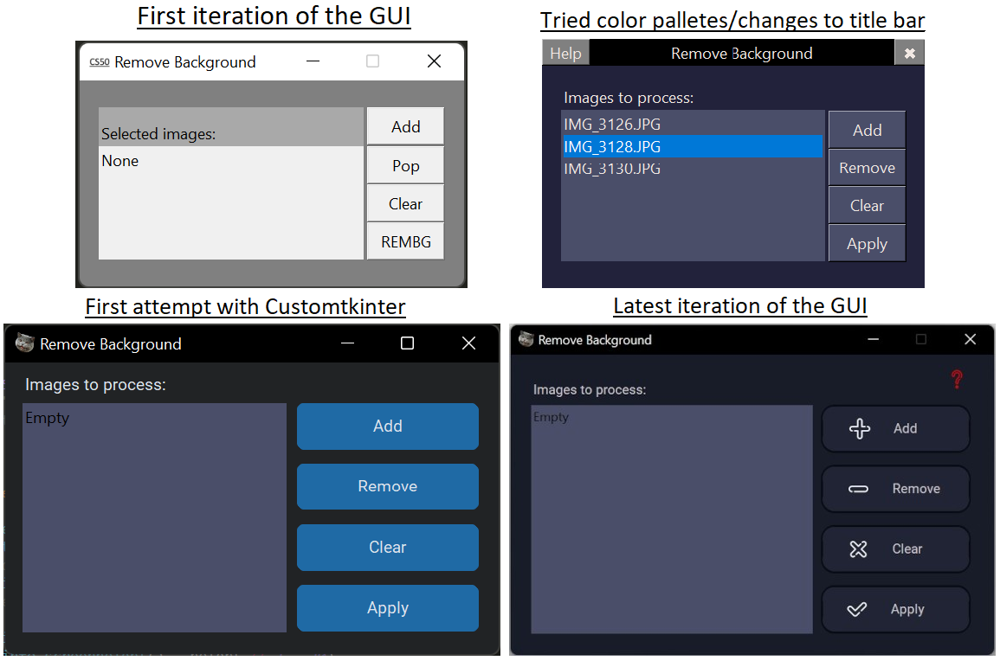

# This is my CS50P project!

This project is a Graphical User Interface for helping making it easier to remove image background offline.
You can add as many jpg, jpeg and png images as you wish and remove their background all at once. Images will
be processed in parallel and the resulting image will be saved alongside the original one with "\_NO\_BG" at
the end of its name.

## project.py

This is the entrypoint of the program. It will pop up a loading screen while it finishes importing its
dependencies in parallel. After it finishes importing its dependencies it will load the main screen.

On the main screen you can:
- Press "Add" to navigate through your folders and select as many images as you wish;
- Press "Remove" to remove individual images from the list after you've added some;
- Press "Clear" to remove all images from the list;
- Press "Apply" to start removing the background of every image in the list;
- Press "?" to read basic info about the app;
- You can scroll down the list of selected images, if it so happens you selected a lot of them.

The app has a loading screen and might stay in it for a few seconds while it loads its dependencies. So, be patient!

You will be prompted to download u2net_human_seg.pth (neural network for human segmentation) if you don't have it already in "\~/.u2net/" folder. It can be found and downloaded here: https://github.com/xuebinqin/U-2-Net

This file also have some minor functions for checking/processing file paths as to pass the project's specific requirements.

## loading_screen.py

Implements the loading screen class. It can be directly executed for testing if it's working. This will receive a list of threads to wait for. It uses a CS50P image.

## main_window.py

Implements the main window class. Theis defines all the GUI widgets, placing and what each does. It uses customtkinter module in attempt to have a more modern feel and some icons from flaticon.com.

## test_project.py

Implements the required test functions and more. Uses parametrized tests to facilitate testing many different situations.

# Evolution of the project.

I started with only tkinter and simple colors, then I tried a few color palletes. Thanks to some tips from active people on CS50 discord I got to learn about customtkinter and managed to get a more windows10/11 feel to the app.

I also had a few more plans of things to add to the app, but getting to where what it is right now took way more time, work and effort than expected. Just placing the widgets and making the screen pretty already creates a rabbit hole of a lot of small little things to work out. Adding the other functionalities I had in mind would take much more time and would probably require a second person (which I couldn't easily find) to finish it (and I don't really have all that time to keep working on this). Something I was really interested in adding was upscaling images with a "WAIFU2X" python module. I managed to get the basics working, but changes to the GUI would be too much to do right now.

# Thanks!

This project uses Python 3.10, everything in "requeriments.txt" and their dependencies.

Button icons: https://www.flaticon.com/br/packs/arrow-54.
Loading Screen: CS50P logo (upscaled).
App Icon: https://github.com/cs50 profile picture (background removed).

MIT License.

Copyright (c) 2022 @ArielMAJ
